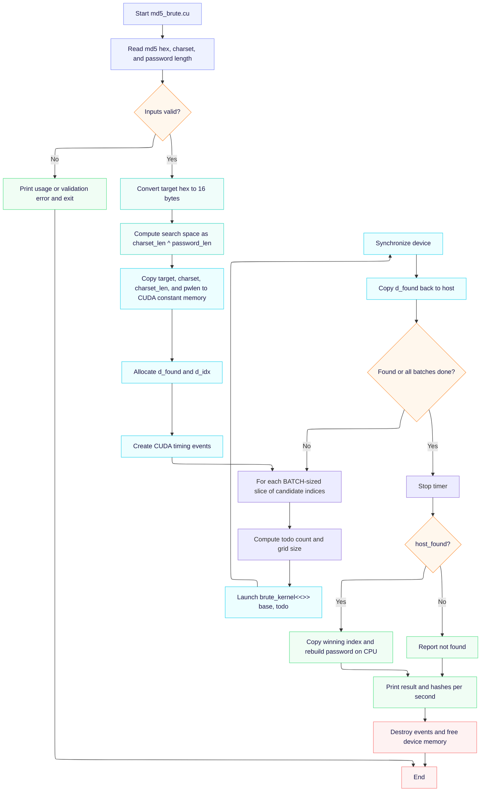
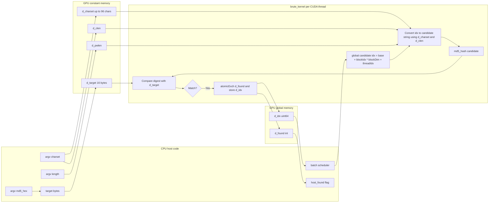
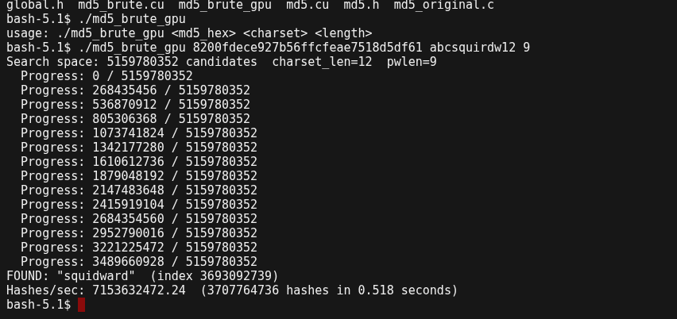
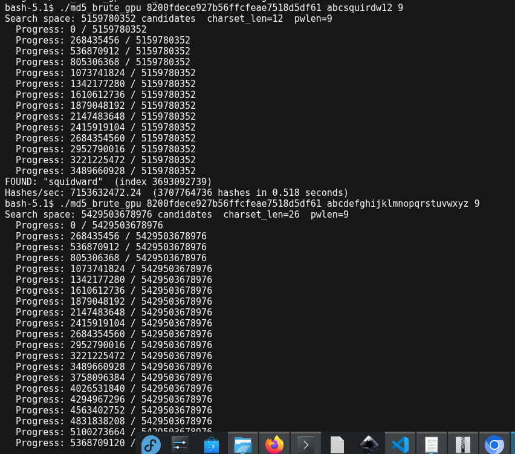
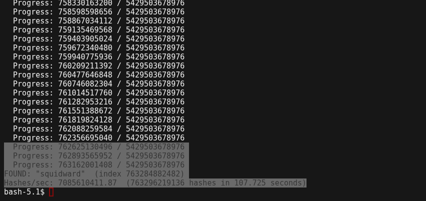

# Problem statement: a brief overview of your project idea.
My ideea was to attack hashes in various ways, largely focused at md5 and xxHash, as they're known and public hashes, with known and public weaknesses, that still have various real world uses. MD5 is still being phased out cryptographically, despite better alternatives existing. xxHash is used non-cryptographically, but has  (or can have) the same properties as md5 beyond its cryptographic strength, which made it a good candidate for doing parity attacks at a lower cost. 

The primary project goal, and one described here, was password hash cracking - a sequential and paralle iteration of it. 

# Sequential Solution : a well-documented serial code for solving the problem in-hand.
The program receives a hex value, converts it into a target set of md5 bytes, reads the charset, and passlength, and then attempts to crack every charset passwd up to that length. 

Cracking is attempted by storing the current index for every position within the input length being attempted (so, if pass_len = 3, indexes might e something like [0,9,5], which for a charset of 10 chars would mean it was on the 95th password, attempting the 9th character in position 2, and the 5th character in position 3). with the position moving left to right (decrementing from maxlen). 

This loop is repeated until it wraps around to the start of both the position count & index array, 0 for both, meaning all candidates of that space were tested. Then it increments. 
```c
#include "md5.h"
#include <errno.h>
#include <limits.h>
#include <stdio.h>
#include <stdlib.h>
#include <string.h>

// cheap hex conversion
static int hex_value(int c)
{
    if (c >= '0' && c <= '9')
        return c - '0';
    if (c >= 'a' && c <= 'f')
        return c - 'a' + 10;
    if (c >= 'A' && c <= 'F')
        return c - 'A' + 10;
    return -1;
}

// validate that a string is md5, and has a value to compute
static int parse_md5_hex(const char *hex, unsigned char digest[16])
{
    if (strlen(hex) != 32)
        return 0;

    for (int i = 0; i < 16; i++)
    {
        int hi = hex_value((unsigned char)hex[i * 2]);
        int lo = hex_value((unsigned char)hex[i * 2 + 1]);
        if (hi < 0 || lo < 0)
            return 0;
        digest[i] = (unsigned char)((hi << 4) | lo);
    }

    return 1;
}

static void md5_bytes(char *string, unsigned int len, unsigned char digest[16])
{
    MD5_CTX context;

    MD5Init(&context);
    MD5Update(&context, (unsigned char *)string, len);
    MD5Final(digest, &context);
}

static int test_candidate(char *candidate, unsigned int len,
                          const unsigned char target[16])
{
    unsigned char digest[16];
    md5_bytes(candidate, len, digest);
    return memcmp(digest, target, 16) == 0;
}

static int crack_length(const unsigned char target[16], const char *charset,
                        size_t charset_len, unsigned int len, char *candidate,
                        size_t *indexes)
{
    memset(indexes, 0, len * sizeof(*indexes));
    memset(candidate, charset[0], len);
    candidate[len] = '\0';

    for (;;)
    {
        if (test_candidate(candidate, len, target))
        {
            printf("Password found: %s\n", candidate);
            return 1;
        }

        unsigned int pos = len;
        while (pos > 0)
        {
            pos--;
            indexes[pos]++;
            if (indexes[pos] < charset_len)
            {
                candidate[pos] = charset[indexes[pos]];
                break;
            }
            indexes[pos] = 0;
            candidate[pos] = charset[0];
        }

        if (pos == 0 && indexes[0] == 0)
            return 0;
    }
}

// brute-force an md5 hash with a provided charset up to a maximum length
int main(int argc, char **argv)
{
    unsigned char target[16];
    char *end = NULL;
    unsigned long max_len;
    const char *charset;
    size_t charset_len;
    char *candidate;
    size_t *indexes;

    if (argc != 4) // validate args
    {
        fprintf(stderr, "usage: %s <md5_hex> <charset> <max_length>\n", argv[0]);
        return 2;
    }

    if (!parse_md5_hex(argv[1], target))
    {
        fprintf(stderr, "invalid md5 hex digest\n");
        return 2;
    }

    charset = argv[2];
    charset_len = strlen(charset); // formally, doesn't elim repeats
    if (charset_len == 0)
    {
        fprintf(stderr, "charset must not be empty\n");
        return 2;
    }

    errno = 0;
    max_len = strtoul(argv[3], &end, 10);
    if (errno || *end != '\0' || max_len == 0 || max_len > UINT_MAX) //validate passlen, ensure that any error isn't caused by invalid systsem/arg state in main
    {
        fprintf(stderr, "max_length must be a positive integer\n");
        return 2;
    }

    candidate = malloc(max_len + 1);
    if (!candidate)
    {
        fprintf(stderr, "failed to allocate candidate buffer\n");
        return 1;
    }

    indexes = malloc(max_len * sizeof(*indexes));
    if (!indexes)
    {
        free(candidate);
        fprintf(stderr, "failed to allocate search buffer\n");
        return 1;
    }

    for (unsigned int len = 1; len <= (unsigned int)max_len; len++)
    {
        if (crack_length(target, charset, charset_len, len, candidate, indexes))
        {
            free(indexes);
            free(candidate);
            return 0;
        }
    }

    free(indexes);
    free(candidate);
    printf("Password not found\n");
    return 1;
}

```


# Parallel Algorithm Design: a pseudocode or a flow chart explaining your parallel solution.
I've included two charts generated by mermaid.ai from my psuedocode. They won't render in my local pdf exporter, but will in github! I will attach the src MD document for this purpose. 



# Parallel Implementation: Your parallel code and should be properly commented.
The parallel implementation is relatively straightforward. We determine a search space for the candidate password (there's no way to know if it's correct, but we delegate the problem to the user) and divide it into a set of indexes for the threads. 

Each thread basically just converts its index to a candidate, hashes it, compares it to the string (converted to a long) the CPU designated, and determines if it has found the password or not. if it hasn't, it continues. If it has, it also continues, except it doesn't do any work & ends quickly. It also, in the case of finding it, returns its id for the CPU to reconstruct later. 

The majority of actual labor is in the hashing itself, which is a duplicate of the RFC code with the same changes as the sequential copy, plus an addendum of flattening/expansion. 

```c
/*
 * md5_brute.cu  –  GPU brute-force MD5 preimage search.
 *
 * Divides the candidate space [0, |charset|^length) among CUDA threads.
 * Each thread converts its index to a base-|charset| string, computes MD5,
 * and compares with the target.
 *
 * Compile:  nvcc -O2 -o md5_brute md5_brute.cu
 * Usage:    ./md5_brute <hex_md5_target> <charset> <length>
 * Example:  ./md5_brute 5f4dcc3b5aa765d61d8327deb882cf99 abcdefghijklmnopqrstuvwxyz 8
 */
#include <stdio.h>
#include <stdlib.h>
#include <string.h>
#include <stdint.h>
#include "md5.h"
#include <cuda_runtime.h>
#include "md5.cu"

#define MAX_LEN    16
#define MAX_CSET   96
#define BLOCK_SIZE 256

/* ── device data ── */
__constant__ uint8_t d_target[16];
__constant__ char    d_charset[MAX_CSET + 1];
__constant__ int     d_clen;
__constant__ int     d_pwlen;

/* ── kernel ── */
__global__ void brute_kernel(uint64_t base, uint64_t total,
                              int *out_found, uint64_t *out_idx)
{
    if (*out_found) return;
    uint64_t idx = base + blockIdx.x * (uint64_t)blockDim.x + threadIdx.x;
    if (idx >= base + total) return;

    /* convert index to string (base d_clen, little-endian digits) */
    char cand[MAX_LEN + 1];
    uint64_t tmp = idx;
    for (int i = 0; i < d_pwlen; i++) {
        cand[i] = d_charset[tmp % (uint64_t)d_clen]; // candidate conversion
        tmp /= (uint64_t)d_clen;
    }
    cand[d_pwlen] = '\0';

    uint8_t digest[16];
    md5_hash((const uint8_t *)cand, (uint32_t)d_pwlen, digest);

    int match = 1;
    for (int i = 0; i < 16; i++) if (digest[i] != d_target[i]) { match=0; break; }
    if (match) {
        if (atomicExch(out_found, 1) == 0) { // exchange match index
            *out_idx = idx;
        }
    }
}

/* ── helpers ── */
static int hex_to_bytes(const char *hex, uint8_t *out, int n) {
    for (int i = 0; i < n; i++) {
        unsigned v;
        if (sscanf(hex + i*2, "%02x", &v) != 1) return -1; // could replace scanf with custom conversion for speed?
        out[i] = (uint8_t)v;
    }
    return 0;
}

static uint64_t ipow64(uint64_t base, int exp) {
    uint64_t r = 1;
    for (int i = 0; i < exp; i++) r *= base;
    return r;
}

int main(int argc, char **argv) {
    if (argc != 4) { fprintf(stderr,"usage: %s <md5_hex> <charset> <length>\n",argv[0]); return 1; } // validate inputs

    uint8_t target[16];
    if (strlen(argv[1]) != 32 || hex_to_bytes(argv[1], target, 16) < 0) { // validate input is a hash
        fprintf(stderr,"bad md5 hex\n"); return 1;
    }
    const char *charset = argv[2];
    int clen = (int)strlen(charset);
    int pwlen = atoi(argv[3]);
    if (clen < 1 || clen > MAX_CSET || pwlen < 1 || pwlen > MAX_LEN) {
        fprintf(stderr,"charset len 1-%d, password len 1-%d\n", MAX_CSET, MAX_LEN); return 1;
    }

    uint64_t space = ipow64((uint64_t)clen, pwlen); // calc search space size
    printf("Search space: %llu candidates  charset_len=%d  pwlen=%d\n",
           (unsigned long long)space, clen, pwlen);

    cudaMemcpyToSymbol(d_target,  target,  16);
    cudaMemcpyToSymbol(d_charset, charset, (size_t)(clen+1));
    cudaMemcpyToSymbol(d_clen,    &clen,   sizeof(int));
    cudaMemcpyToSymbol(d_pwlen,   &pwlen,  sizeof(int));

    int *d_found; cudaMalloc(&d_found,  sizeof(int));      cudaMemset(d_found, 0, sizeof(int));
    uint64_t *d_idx;   cudaMalloc(&d_idx,    sizeof(uint64_t)); cudaMemset(d_idx, 0, 8);

    const uint64_t BATCH = (uint64_t)BLOCK_SIZE * 65536; /* tune as needed, maximizes saturation */
    int host_found = 0;
    uint64_t hashes_done = 0;
    cudaEvent_t start, stop;
    cudaEventCreate(&start);
    cudaEventCreate(&stop);
    cudaEventRecord(start);

    for (uint64_t base = 0; base < space && !host_found; base += BATCH) {
        uint64_t todo  = (base + BATCH < space) ? BATCH : (space - base);
        uint32_t grids = (uint32_t)((todo + BLOCK_SIZE - 1) / BLOCK_SIZE);
        brute_kernel<<<grids, BLOCK_SIZE>>>(base, todo, d_found, d_idx);    // dispatch kernel
        cudaDeviceSynchronize();
        hashes_done += todo;
        cudaMemcpy(&host_found, d_found, sizeof(int), cudaMemcpyDeviceToHost);
        if (base % (BATCH * 16) == 0)
            printf("  Progress: %llu / %llu\n", (unsigned long long)base,
                   (unsigned long long)space);
    }

    cudaEventRecord(stop);
    cudaEventSynchronize(stop);
    float elapsed_ms = 0.0f;
    cudaEventElapsedTime(&elapsed_ms, start, stop);

    if (host_found) {
        uint64_t idx;
        cudaMemcpy(&idx, d_idx, sizeof(uint64_t), cudaMemcpyDeviceToHost);
        /* recover string on CPU */
        char cand[MAX_LEN + 1]; uint64_t tmp = idx;
        for (int i = 0; i < pwlen; i++) { cand[i]=charset[tmp%clen]; tmp/=clen; } // conversion to base_k
        cand[pwlen]='\0';
        printf("FOUND: \"%s\"  (index %llu)\n", cand, (unsigned long long)idx);
    } else {
        printf("Not found in search space.\n");
    }
    double elapsed_s = (double)elapsed_ms / 1000.0;
    double hashes_per_second = elapsed_s > 0.0 ? (double)hashes_done / elapsed_s : 0.0;
    printf("Hashes/sec: %.2f  (%llu hashes in %.3f seconds)\n",
           hashes_per_second, (unsigned long long)hashes_done, elapsed_s);

    cudaEventDestroy(start); cudaEventDestroy(stop);
    cudaFree(d_found); cudaFree(d_idx);
    return 0;
}

```

# Results : the output for sample test case(s). Include Screenshots for the running results.
it successfully cracks both crafted hashes & random keysmashes, while not ending (correctly) against sufficiently large spaces. 

```
Search space: 5159780352 candidates  charset_len=12  pwlen=9
  Progress: 0 / 5159780352
  Progress: 268435456 / 5159780352
  Progress: 536870912 / 5159780352
  Progress: 805306368 / 5159780352
  Progress: 1073741824 / 5159780352
  Progress: 1342177280 / 5159780352
  Progress: 1610612736 / 5159780352
  Progress: 1879048192 / 5159780352
  Progress: 2147483648 / 5159780352
  Progress: 2415919104 / 5159780352
  Progress: 2684354560 / 5159780352
  Progress: 2952790016 / 5159780352
  Progress: 3221225472 / 5159780352
  Progress: 3489660928 / 5159780352
FOUND: "squidward"  (index 3693092739)
```





# Performance Evaluation: Compute the speedup to assess the performance of the implemented method.


The script was tested on both the J and G subclusters, of which the best results were found with the G subcluster (results below). 
```txt
Sanity test: FOUND ba (4 hashes, 0.000000s CUDA, 20,896.02 H/s)
Running small_full: charset_len=26 length=6
Running medium_full: charset_len=26 length=7
Running hex_full: charset_len=16 length=8

Benchmark results
------------------------------------------------------------------------------------------------------------
case             charset len          space         hashes     cuda_s     wall_s       hashes/sec
------------------------------------------------------------------------------------------------------------
small_full            26   6    308,915,776    308,915,776      0.040      0.238 7,793,497,552.56
medium_full           26   7  8,031,810,176  8,031,810,176      1.028      1.220 7,813,466,145.61
hex_full              16   8  4,294,967,296  4,294,967,296      0.533      0.728 8,053,030,809.73
------------------------------------------------------------------------------------------------------------
Average throughput: 7,886,664,835.97 H/s
Best throughput:    8,053,030,809.73 H/s
Worst throughput:   7,793,497,552.56 H/s
```

The averages for the scholar cluster's frontend nodes are as follows (both single & parallel):

Single:
```
=== AVERAGES ===
Time(s) | Avg Throughput | StdDev
---------------------------------------------
1 | 2463623.01 | 667.55
2 | 2463118.87 | 995.00
5 | 2465496.72 | 1827.66
10 | 2465900.76 | 957.87
30 | 2464368.67 | 1486.97
```

Parallel:
```
=== AVERAGE THROUGHPUT ===
Nodes | Avg H/s | StdDev
----------------------------------------
5 | 12310208.34 | 11729.93
10 | 19770236.73 | 20856.95
20 | 19729148.68 | 34450.97
50 | 19604849.07 | 102695.33
=== SPEEDUP RELATIVE TO 5 NODES ===
Nodes | Speedup | Efficiency
------------------------------------
5 | 1.000 | 0.2000
10 | 1.606 | 0.1606
20 | 1.603 | 0.0801
50 | 1.593 | 0.0319
```

All 

| Implementation | Avg Hps (max) | Perf Mult (relative to local PC) |
| --- | --- | --- |
| Local PC | 642,190.90 | 1x |
| Scholar CPU (fe, 1 node) | 2,465,900.76  | ~3.839x |
| Scholar CPU (fe, multi-node)| 19,770,236.73 | ~30.785x |
| GPU (local) | 7,267,999,500.03 | ~11,317.506x |

| Implementation | Avg Hps (max) | Perf Mult (relative to local Scholar CPU impl) |
| --- | --- | --- |
| Scholar CPU (fe, 1 node) | 2,465,900.76  | 1x |
| Scholar CPU (fe, multi-node)| 19,770,236.73 | ~8.017x |
| GPU (local) | 7,267,999,500.03 | ~2,947.501x |

The GPU has a 376x speedup relative to the fastest official CPU implementation for this project, and 55x against the fastest theoretical scaleup, a significant increase regardless. The implemented method attempts to maximize compute saturation, something that as done decently but could be improved through things like asynchronous emmory transfer, and CPU-side computations. Additionally, I fail to implement any attacks against MD5 itself that might allow for super-linear scaling rather than simple linear scaling. 

The CPU solution scales poorly, and meets scaling limits rather quickly. Maximizing inter-node parallelism & using muiltiple subclusters would only allow a CPU implementation to scale to hundreds of millions of hashes per second at most, while adding difficulty to the problem of synchronization & communication between nodes. One critical reason for this is the limited number of true threads that can do work, paired with the massiveness of the search space. 

At its current speed, it would take ~700 seconds, or 11 minutes, to crack all alphanumeric passwords of length <=9. (including those of length 8, 7, 6, etc.)


# Lessons Learned : What CUDA concept was hardest to understand, and how did you overcome it? 
In this particular case, the hardest part when writing was porting the md5 implementation over, as I didn't want the GPU calling CPU side code when running, but the RFC implementation wasn't originally written for the CPU (or even modern C). This ended up being a simple but tedious rewrite of the core functionality, ending in a manual update of the original code for CPU, folowed by preprocessed expansion and forced inlining of the code into the GPU kernel. 

I did significant study of CUDA & GPUs prior to this work, followed by reading the literature on the subject, and so the next hardest issue - work division & memory management - ended up being somewhat straightforward. As noted in the code, I simply convert the charset + passlength into an integer range and a base-k space, so I can convert between base10 and a basek password candidate. This ensures coverage, and keeps a largely lockstep execution. 

I will note that I tried to remove branching by using modulo within base conversion, something I would refrain from in the future. I would instead opt to increase the execution coherence by attempting to identify all place-increments. This is because counting to k in basek, or counting to 10 in base 10, requires moving to the next position, which when done by one threap in a warp or kernel means execution diverges. If this was identified, and the series of integers which had this behavior (or a generator for them) were identified, candidate indexes could be reordered for the GPU, such that instead of doing hash(i) for i in R, we created a subrange R1 to Rk of workloads to handle place increments, and a final range for the remainder of the workload, and sent them to the GPU separately. This would maximize their execution alignment. 